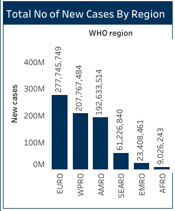

# WHO Covid-19 Global Data Analysis

## Project Overview

### Introduction:
 Introduction:
The Covid-19 Global Analysis project aims to comprehensively analyze the impact of the Covid-19 pandemic on a global scale. By collecting, processing, and visualizing data from various sources, the project seeks to provide insights into the spread of the virus, its effects on public health systems, socio-economic implications, and response strategies adopted by different countries.

### Objectives:
- Compile and analyze the total number of new Covid-19 cases by region to identify regions experiencing increases in case counts.
- Identify and rank the top 10 countries with the highest number of new Covid-19 cases to highlight regions with the most significant outbreaks.
- Determine and rank the top 10 countries with the highest number of new Covid-19-related deaths to assess the impact of the pandemic on mortality rates.
- Analyze and report on new Covid-19 deaths by region to understand regional variations in mortality rates.
- Identify and rank the least 10 countries with new Covid-19 cases to highlight regions with lower incidence rates.
- Determine and rank the least 10 countries with new Covid-19-related deaths to assess regions with lower mortality rates.
- Identify and rank the top 10 countries with the highest number of Covid-19 vaccinations administered to evaluate progress in vaccination efforts.
- Analyze and report on the cumulative number of Covid-19 cases and deaths by year to assess the trajectory of the pandemic over time.
- Identify and rank the least 10 countries with the highest number of Covid-19 vaccinations administered to evaluate equitable access to vaccines.
- Develop and present a geospatial map illustrating new Covid-19 cases and deaths globally to visualize the geographic distribution and hotspots of the pandemic.

### Deliverables:
- Compilation and analysis of new Covid-19 cases by region, identifying areas with increased case counts.
- Identification and ranking of the top 10 countries with the highest new Covid-19 case counts, highlighting regional outbreaks.
- Ranking and analysis of the top 10 countries with the highest new Covid-19-related deaths, assessing mortality rates.
- Analysis and reporting on new Covid-19 deaths by region, understanding mortality rate disparities.
- Identification and ranking of the least 10 countries with new Covid-19 cases, assessing low-incidence regions.
- Assessment and ranking of the least 10 countries with new Covid-19-related deaths, examining lower mortality rates.
- Analysis and ranking of the top 10 countries with the highest Covid-19 vaccination rates, evaluating progress.
- Detailed analysis and reporting on cumulative Covid-19 cases and deaths by year, assessing pandemic trajectory.
- Identification and ranking of the least 10 countries with the highest Covid-19 vaccination rates, focusing on equitable access.
- Development of a geospatial map illustrating new Covid-19 cases and deaths globally, aiding visualization and analysis.

### About The Dataset
The "WHO Covid-19 Global Data Analysis" project involves analyzing comprehensive data provided by the World Health Organization (WHO) regarding the Covid-19 pandemic on a global scale. The data encompasses various aspects of the pandemic, including confirmed cases, deaths, recoveries, testing rates, vaccination coverage, and other relevant metrics. The data in this dataset was collected from the WHO Covid-19 dashboard data downloadable statistical release on the 31st of Decemember, 2023. This data is updated weekly. Users should note that, in addition to capturing new cases and deaths reported on any given day, updates are made retrospectively to correct counts on previous days as needed based on subsequent information received.. You can click [here](https://data.who.int/dashboards/covid19/data) to visit the WHO website and access the latest update.

The data source is made up of 4 datasets, and they are: vaccination-data.csv, vaccination-metadata, WHO-Covid-19-global-data.csv, and WHO-Covid-19-global-table-data.csv. You can access all of them [here](datasets)

### Skills Utilized
1. Data Transformation
2. Data Visualiziation
3. Descriptive Analytics
4. Critical Thinking and Problem Solving
5. Communication and Reporting

### Tools Utilized
1. Microsoft Excel
    - Was used to:
        1. Was used to save extracted data from WHO website,
        2. Transform,
        3. Load the dataset for this analysis.
     
2. Tableau (Was used to create dashboards for this analysis)
    - The following Tableau were incorporated:
        1. Calculated Fields
        2. Geospatial Analysis
        3. Page Navigation
        4. Filters
        5. Tooltips
        6. Buttons

### Data Transformation and Loading in Microsoft Excel and Tableau:
- Did the first data cleaning in Microsoft excel before loading the dataset to Tableau.
- Changed the data types to the appropriate data types in Tableau.

**Tableau Data View**

Tableau Data Screenshot                                                             |                                
:---------------------------------------------------------------------------------:|

## Join/ Blend Data
There was no need to join or blend data as we have just a single table for this analysis.

## Tableau Visualization:
#### Dashboard View 1

#### Dashboard View 2

### WHO Project Analysis:
In this analysis, the following Key findings below were made:
- The Cumulative Covid-19 Cases at the time if this analysis was __78,104,887,614.__
- The New Cases was __773,119,173.__
- The Cases recorded as of Last 7 Days of this Analysis was __1,813,700.__
- The Cumulative Deaths was __924,851,078.__
- The Deaths recorded as of the Last 7 Days of this Analysis was __8,736.__
- The Number of Countries captured in this Analysis was __234.__

- 
- **Total Number of New Cases By Region:**
- This analysis is on the provides
