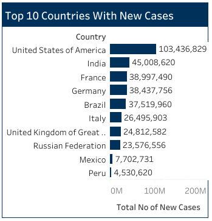
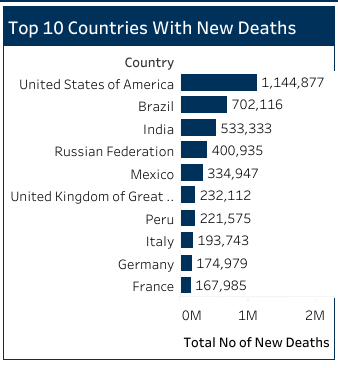
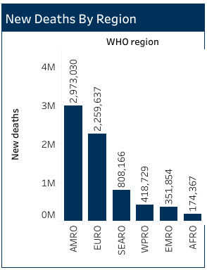

# WHO Covid-19 Global Data Analysis

## Project Overview

### Introduction:
 Introduction:
The Covid-19 Global Analysis project aims to comprehensively analyze the impact of the Covid-19 pandemic on a global scale. By collecting, processing, and visualizing data from various sources, the project seeks to provide insights into the spread of the virus, its effects on public health systems, socio-economic implications, and response strategies adopted by different countries.

### Objectives:
- Compile and analyze the total number of new Covid-19 cases by region to identify regions experiencing increases in case counts.
- Identify and rank the top 10 countries with the highest number of new Covid-19 cases to highlight regions with the most significant outbreaks.
- Determine and rank the top 10 countries with the highest number of new Covid-19-related deaths to assess the impact of the pandemic on mortality rates.
- Analyze and report on new Covid-19 deaths by region to understand regional variations in mortality rates.
- Identify and rank the least 10 countries with new Covid-19 cases to highlight regions with lower incidence rates.
- Determine and rank the least 10 countries with new Covid-19-related deaths to assess regions with lower mortality rates.
- Identify and rank the top 10 countries with the highest number of Covid-19 vaccinations administered to evaluate progress in vaccination efforts.
- Analyze and report on the cumulative number of Covid-19 cases and deaths by year to assess the trajectory of the pandemic over time.
- Identify and rank the least 10 countries with the highest number of Covid-19 vaccinations administered to evaluate equitable access to vaccines.
- Develop and present a geospatial map illustrating new Covid-19 cases and deaths globally to visualize the geographic distribution and hotspots of the pandemic.

### Deliverables:
- Compilation and analysis of new Covid-19 cases by region, identifying areas with increased case counts.
- Identification and ranking of the top 10 countries with the highest new Covid-19 case counts, highlighting regional outbreaks.
- Ranking and analysis of the top 10 countries with the highest new Covid-19-related deaths, assessing mortality rates.
- Analysis and reporting on new Covid-19 deaths by region, understanding mortality rate disparities.
- Identification and ranking of the least 10 countries with new Covid-19 cases, assessing low-incidence regions.
- Assessment and ranking of the least 10 countries with new Covid-19-related deaths, examining lower mortality rates.
- Analysis and ranking of the top 10 countries with the highest Covid-19 vaccination rates, evaluating progress.
- Detailed analysis and reporting on cumulative Covid-19 cases and deaths by year, assessing pandemic trajectory.
- Identification and ranking of the least 10 countries with the highest Covid-19 vaccination rates, focusing on equitable access.
- Development of a geospatial map illustrating new Covid-19 cases and deaths globally, aiding visualization and analysis.

### About The Dataset
The "WHO Covid-19 Global Data Analysis" project involves analyzing comprehensive data provided by the World Health Organization (WHO) regarding the Covid-19 pandemic on a global scale. The data encompasses various aspects of the pandemic, including confirmed cases, deaths, recoveries, testing rates, vaccination coverage, and other relevant metrics. The data in this dataset was collected from the WHO Covid-19 dashboard data downloadable statistical release on the 31st of Decemember, 2023. This data is updated weekly. Users should note that, in addition to capturing new cases and deaths reported on any given day, updates are made retrospectively to correct counts on previous days as needed based on subsequent information received.. You can click [here](https://data.who.int/dashboards/covid19/data) to visit the WHO website and access the latest update.

The data source is made up of 4 datasets, and they are: vaccination-data.csv, vaccination-metadata, WHO-Covid-19-global-data.csv, and WHO-Covid-19-global-table-data.csv. You can access all of them [here](datasets)

### Skills Utilized
1. Data Transformation
2. Data Visualiziation
3. Descriptive Analytics
4. Critical Thinking and Problem Solving
5. Communication and Reporting

### Tools Utilized
1. Microsoft Excel
    - Was used to:
        1. Was used to save extracted data from WHO website,
        2. Transform,
        3. Load the dataset for this analysis.
     
2. Tableau (Was used to create dashboards for this analysis)
    - The following Tableau were incorporated:
        1. Calculated Fields
        2. Geospatial Analysis
        3. Page Navigation
        4. Filters
        5. Tooltips
        6. Buttons

### Data Transformation and Loading in Microsoft Excel and Tableau:
- Did the first data cleaning in Microsoft excel before loading the dataset to Tableau.
- Changed the data types to the appropriate data types in Tableau.

**Tableau Data View**

Tableau Data Screenshot                                                             |                                
:---------------------------------------------------------------------------------:|

## Join/ Blend Data
There was no need to join or blend data as we have just a single table for this analysis.

## Tableau Visualization:
#### Dashboard View 1

#### Dashboard View 2

### WHO Project Analysis:
In this analysis, the following Key findings below were made:
- The Cumulative Covid-19 Cases at the time if this analysis was __78,104,887,614.__
- The New Cases was __773,119,173.__
- The Cases recorded as of Last 7 Days of this Analysis was __1,813,700.__
- The Cumulative Deaths was __924,851,078.__
- The Deaths recorded as of the Last 7 Days of this Analysis was __8,736.__
- The Number of Countries captured in this Analysis was __234.__

- 
- **Total Number of New Cases By Region:**
- This is an analysis of the World Health Organization (WHO) on the total number of new Covid-19 cases by region. It offers valuable insights into the global distribution and impact of the pandemic. Let's analyze each WHO region to glean insights into the patterns and trends observed:
- __EURO Region:__ The EURO region reported the highest number of new Covid-19 cases, totaling approximately 277,745,749 cases. This region encompasses countries in Europe, which have been significantly affected by the pandemic since its onset. The high number of cases in this region reflects the widespread transmission of the virus and the challenges faced in controlling its spread despite advanced healthcare systems and public health interventions.
- __WPRO Region:__ The WPRO region reported a substantial number of new Covid-19 cases, totaling around 207,767,484 cases. This region comprises countries in the Western Pacific, including populous nations like China and Japan. The significant case count in this region highlights the global reach of the pandemic. 
- __AMRO Region:__ The AMRO region reported a considerable number of new Covid-19 cases, totaling approximately 192,633,514 cases. This region encompasses countries in the Americas, including the United States, Brazil, and Mexico, which have been heavily impacted by the pandemic. Factors such as population density, healthcare infrastructure, and socio-economic disparities contribute to the high case count in this region.
- __SEARO Region:__ The SEARO region reported a moderate number of new Covid-19 cases, totaling around 61,226,840 cases. This region includes countries in Southeast Asia, such as India, Indonesia, and Thailand. While the case count in this region is lower compared to others, it still represents a significant burden of disease. 
- __EMRO Region:__ The EMRO region reported a comparatively lower number of new Covid-19 cases, totaling around 23,408,461 cases. This region includes countries in the Eastern Mediterranean, such as Iran, Saudi Arabia, and Egypt. While the case count in this region is lower compared to others, it still represents a significant challenge for healthcare systems. 
- __AFRO Region:__ The AFRO region reported the lowest number of new Covid-19 cases, totaling approximately 9,026,243 cases. This region comprises countries in Africa, where the pandemic has had a varied impact, with some countries experiencing significant outbreaks while others have been relatively spared. Factors such as limited testing capacity, infrastructure challenges, and younger populations may contribute to the lower case count in this region.

- 
- **Top 10 Countries With New Cases:**
- In this analysis on the top 10 countries with new Covid-19 cases, insights were offered into the global distribution and magnitude of the pandemic. Let's analyze each country to understand the patterns and trends observed:
- __United States of America:__ Leading the list with 103,436,829 new cases, the USA remained heavily impacted by the pandemic, highlighting ongoing challenges in containment efforts.
- __India:__ Following closely with 45,008,620 new cases, India continued to experience significant transmission rates despite recent vaccination efforts and containment measures.
- __France:__ France reported 38,997,490 new cases, indicating substantial community transmission and the need for stringent public health interventions to curb the spread.
- __Germany:__ With 38,437,756 new cases, Germany faced persistent challenges in controlling outbreaks and ensuring healthcare capacity amidst the pandemic.
- __Brazil:__ Brazil reported 37,519,960 new cases, reflecting the widespread transmission of the virus and the strain on the country's healthcare system.
- __Italy:__ Italy reported 26,495,903 new cases, demonstrating the continued impact of the pandemic on European countries and the importance of coordinated response efforts.
- __United Kingdom of Great Britain and Northern Ireland:__ The UK reported 24,812,582 new cases, underscoring the need for continued vigilance and adherence to public health guidelines to mitigate transmission rates.
- __Russian Federation:__ Russia reported 23,576,556 new cases, exposing the global reach of the pandemic and the challenges in controlling transmission in densely populated regions.
- __Mexico:__ Mexico reported 7,702,731 new cases, indicating significant transmission rates and the need for enhanced testing, contact tracing, and vaccination efforts.
- __Peru:__ Peru reported 4,530,620 new cases, underlining the impact of the pandemic on countries with limited healthcare infrastructure and resources.

- 
- **Top 10 Countries With New Deaths:**
- In the analysis of the top 10 countries with the highest number of new Covid-19 deaths, i  provided critical insights into the severity of the pandemic's impact on global mortality rates:
- __United States of America:__ Leading the list with 1,144,877 new deaths, the USA continued to face significant challenges in managing the pandemic and reducing mortality rates.
- __Brazil:__ Brazil follows closely with 702,116 new deaths, highlighting the devastating toll of the virus on the country's population and healthcare system.
- __India:__ India reported 533,333 new deaths, indicating the widespread impact of the pandemic despite recent efforts to ramp up vaccination and containment measures.
- __Russian Federation:__ With 400,935 new deaths, Russia faces ongoing challenges in controlling transmission and ensuring access to healthcare services for Covid-19 patients.
- __Mexico:__ Mexico reported 334,947 new deaths, emphasizing the need for continued vigilance and public health interventions to mitigate the spread of the virus.
- __United Kingdom of Great Britain and Northern Ireland:__ The UK reported 232,112 new deaths, underlining the importance of maintaining effective public health measures and vaccination campaigns.
- __Peru:__ Peru reported 221,575 new deaths, highlighting the impact of the pandemic on countries with limited healthcare infrastructure and resources.
- __Italy:__ Italy reported 193,743 new deaths, demonstrating the persistent challenges in controlling transmission and reducing mortality rates despite early outbreaks.
- __Germany:__ Germany reported 174,979 new deaths, indicating the ongoing need for robust public health responses and vaccination campaigns to protect vulnerable populations.
- __France:__ France reported 167,985 new deaths, reflecting the continued burden of the pandemic on healthcare systems and the importance of coordinated international efforts to combat the virus.

- 
- **New Deaths By Region:**
- In the data on new Covid-19 deaths by WHO region, key insights were provided into the distribution and impact of mortality rates globally:
- __AMRO (Americas):__ With 2,973,030 new deaths, the AMRO region, comprising the Americas, faces significant mortality rates, reflecting the severity of the pandemic in this region.
- __EURO (Europe):__ EURO reported 2,259,637 new deaths, indicating substantial mortality rates and the toll of the pandemic on European countries despite advanced healthcare systems.
- __SEARO (Southeast Asia):__ SEARO reported 808,166 new deaths, highlighting the impact of the pandemic on countries in Southeast Asia and the need for enhanced healthcare infrastructure and resources.
- __WPRO (Western Pacific):__ WPRO reported 418,729 new deaths, indicating the toll of the pandemic on countries in the Western Pacific region and the challenges in controlling transmission rates.
- __EMRO (Eastern Mediterranean):__ EMRO reported 351,854 new deaths, demonstrating the impact of the pandemic on countries in the Eastern Mediterranean region and the importance of coordinated response efforts.
- __AFRO (Africa):__ AFRO reported 174,367 new deaths, indicating comparatively lower mortality rates in the African region but underscoring the need for continued vigilance and public health interventions.

- 
- **Least 10 Countries With New Cases:**
- In this analysis of the data on the least 10 countries with new Covid-19 cases, i shedded light on regions experiencing minimal transmission rates:
- __Wallis and Futuna:__ With 3,550 new cases, Wallis and Futuna demonstrate minimal transmission rates, potentially attributed to its small population and remote location.
- __Saint Pierre Miquelon:__ Reporting 3,426 new cases, Saint Pierre Miquelon's low population density and stringent border controls likely contribute to its low transmission rates.
- __Tuvalu:__ Tuvalu reported 2,943 new cases, benefiting from its isolated location and small population, which aids in controlling the spread of the virus.
- __Saint Helena:__ With 2,166 new cases, Saint Helena's isolated geographical location and limited population contribute to its low transmission rates.
- __Falkland Islands (Malvinas):__ Reporting 1,923 new cases, the Falkland Islands benefit from their remote location and sparse population, which may help contain the spread of the virus.
- __Montserrat:__ Montserrat reports 1,403 new cases, likely influenced by its small population size and effective public health measures.
- __Niue:__ With 895 new cases, Niue's low population density and geographic isolation contribute to its ability to control transmission rates effectively.
- __Tokelau:__ Tokelau reports only 80 new cases, benefitting from its remote location and small population, which aids in preventing widespread transmission.
- __Holy See:__ Reporting 20 new cases, the Holy See's small population and strict measures likely contribute to its minimal transmission rates.
- __Pitcairn:__ With only 4 new cases, Pitcairn's extremely low population density and isolation help keep transmission rates negligible.
