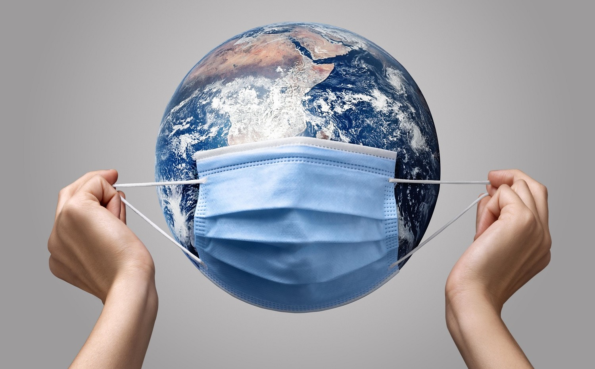
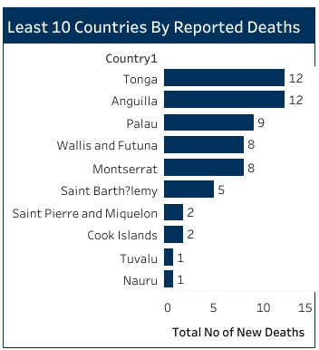

# WHO Covid-19 Global Data Analysis

 

## Table of Contents
- [Project Overview](#project-overview)
- [About The Dataset](#about-the-dataset)
- [Tools Utilized](#tools-utilized)
- [Tableau Visualization](#tableau-visualization)
- [WHO Project Analysis](#who-project-analysis)
- [Tableau Visualization Dashboard](#tableau-visualization-dashboard)
- [Recommendations On Reducing The Global Spread of Covid-19](#recommendations-on-reducing-the-global-spread-of-covid-19)
 

## Project Overview

### Introduction:
Covid-19 Global Analysis seeks to do an in-depth analysis of the extent of damage caused by the pandemic globally.The objective of this project is to get insights into how the virus has spread, its impacts on health systems, socio-economic effects, and response strategies adopted at the country level by collecting, processing, and visualizing data from several sources.

### Objectives:
- Compile and analyze the total number of new Covid-19 cases by region to identify regions experiencing increases in case counts.
- Identify and rank the top 10 countries with the highest number of new Covid-19 cases to highlight regions with the most significant outbreaks.
- Determine and rank the top 10 countries with the highest number of new Covid-19-related deaths to assess the impact of the pandemic on mortality rates.
- Analyze and report on new Covid-19 deaths by region to understand regional variations in mortality rates.
- Identify and rank the least 10 countries with new Covid-19 cases to highlight regions with lower incidence rates.
- Determine and rank the least 10 countries with new Covid-19-related deaths to assess regions with lower mortality rates.
- Identify and rank the top 10 countries with the highest number of Covid-19 vaccinations administered to evaluate progress in vaccination efforts.
- Analyze and report on the cumulative number of Covid-19 cases and deaths by year to assess the trajectory of the pandemic over time.
- Identify and rank the least 10 countries with the highest number of Covid-19 vaccinations administered to evaluate equitable access to vaccines.
- Develop and present a geospatial map illustrating new Covid-19 cases and deaths globally to visualize the geographic distribution and hotspots of the pandemic.

### Deliverables:
- Compilation and analysis of new Covid-19 cases by region, identifying areas with increased case counts.
- Identification and ranking of the top 10 countries with the highest new Covid-19 case counts, highlighting regional outbreaks.
- Ranking and analysis of the top 10 countries with the highest new Covid-19-related deaths, assessing mortality rates.
- Analysis and reporting on new Covid-19 deaths by region, understanding mortality rate disparities.
- Identification and ranking of the least 10 countries with new Covid-19 cases, assessing low-incidence regions.
- Assessment and ranking of the least 10 countries with new Covid-19-related deaths, examining lower mortality rates.
- Analysis and ranking of the top 10 countries with the highest Covid-19 vaccination rates, evaluating progress.
- Detailed analysis and reporting on cumulative Covid-19 cases and deaths by year, assessing pandemic trajectory.
- Identification and ranking of the least 10 countries with the highest Covid-19 vaccination rates, focusing on equitable access.
- Development of a geospatial map illustrating new Covid-19 cases and deaths globally, aiding visualization and analysis.
 
 

### About The Dataset
WHO Covid-19 Global Data Analysis": all data analysis on the pandemic by the World Health Organization regarding the Covid-19 globally.The dataset shall contain all information on the situation of the pandemic, confirming cases, deaths, recoveries, testing rate, vaccination coverage, and other metrics for the pandemic. The data in this dataset was collected from the WHO Covid-19 dashboard data downloadable statistical release on the 31st of Decemember, 2023. This data is updated weekly. Users should note that, in addition to capturing new cases and deaths reported on any given day, updates are made retrospectively to correct counts on previous days as needed based on subsequent information received.. You can click [here](https://data.who.int/dashboards/covid19/data) to visit the WHO website and access the latest update.

The data source is made up of 4 datasets, and they are: vaccination-data.csv, vaccination-metadata, WHO-Covid-19-global-data.csv, and WHO-Covid-19-global-table-data.csv. You can access all of them [here](datasets)
 
 

### Skills Utilized
1. Data Transformation
2. Data Visualiziation
3. Descriptive Analytics
4. Analytical Thinking and Critical Thinking
5. Problem Solving
6. Communication and Reporting
 

### Tools Utilized
1. Microsoft Excel
    - Was used to:
        1. Save extracted data from WHO website,
        2. Clean and Transform the data,
        3. Load the datasets for this analysis.
     
2. Tableau (Was used to create dashboards for this analysis)
    - The following Tableau tools were incorporated:
        1. Calculated Fields
        2. Geospatial Analysis
        3. Page Navigation
        4. Filters
        5. Tooltips
        6. Buttons
 

### Data Transformation and Loading in Microsoft Excel and Tableau:
- Did the first data cleaning in Microsoft excel before loading the dataset to Tableau.
- Changed the data types to the appropriate data types in Tableau.
 

## Join/ Blend Data
The data required for this analysis are located in various tables. Therefore, data blending was required. A star join was designed with the __vaccination-data__ table representing the fact table containing quantitative measures (vaccinations), and to which other dimension tables are modelled or connected to, using the __Country__  and __Name__ fields. 

The __vaccination-data__ table has been blended with:

- __WHO-COVID-19-global-data__ table using the __Country__ field.
- __WHO-COVID-19-global-table-data__ table using the __Name__ field.

- The Data Source View displays a view of the __vaccination-data__ (fact) table, the __WHO-COVID-19-global-data__ table (dimension), and the __WHO-COVID-19-global-table-data__ table (dimension).

Data Source View                                                                   |                                
:---------------------------------------------------------------------------------:|
                        |    
 
 

## Tableau Visualization:
#### Dashboard View 1

#### Dashboard View 2

 
 

### WHO Project Analysis:
In this analysis, the following Key findings below were made:
- The Reported Cases was __773,119,173.__
- The Cases recorded as of Last 7 Days of this Analysis was __518,208.__
- The Reported Deaths was __6,990,067.__
- The Deaths recorded as of the Last 7 Days of this Analysis was __2,496.__
- The Number of Countries captured in this Analysis was __234.__
 
 

- 

- **Reported Cases By Region:**
- This is from the World Health Organization analysis in relation to the total number of new Covid-19 cases reported by region. This puts into perspective what the global distribution and impact of the pandemic are. Let's look at each region from WHO to see what lessons can be gained for the pattern and trend set:
- __EURO Region:__ The EURO region reported new cases of Covid-19 to be the highest, about 277,745,749 cases. They were from countries in Europe, most of which have been at the receiving end since the outbreak. The principal factor that may have contributed to this trend in infection here could be the tremendous velocity at which contagion has spread and has, so far, not been controlled despite all advanced health facilities and public health measures in place.
- __WPRO region:__ WPRO returned a high number of new Covid-19 cases at about 207,767,484 cases. It involves countries within the Western Pacific area, which has a pretty nice number of populous countries like China and Japan. That large count of cases in the region puts into perspective how far-reaching the pandemic has been.
- __AMRO region:__ To this end, the number of new cases of Covid-19 in the AMRO region has been quite huge with some 192,633,514 cases. This was implicated with the countries from the Americas like the United States, Brazil, and Mexico that had been hit terribly by this pandemic. This explained well by the fact that these areas were densely populated coupled with bad health infrastructures and socio-economic disparity.
- __SEARO Region:__ This region had approximately 61,226,840 new Covid-19 cases. These are the countries in the Southeast Asian region, inclusive of India, Indonesia, and Thailand. The count of the cases in this region was relative to other regions on the low side; however, it is still a heavyweight disease burden.
- __EMRO Region:__ The EMRO region reported relatively fewer new cases of about 23,408,461. This region comprises most of the countries in the Eastern Mediterranean, including Iran, Saudi Arabia, and Egypt. Though the count of cases in this region is fairly low compared to the rest of the world, it is still sufficiently high to burden any healthcare system.
- __AFRO Region:__ The AFRO region had the least number of new cases of Covid-19 at about 9,026,243 cases. This region holds countries in the African continent where the effect of the pandemic has varied, some going through major outbreaks and others having relatively been spared. Contributing issues may be, among others, limited testing capacity, weak infrastructure and structure, and relative youth of populations in this region.
 
 

- 

- **Top 10 Countries By Reported Cases:**
- In this analysis on the top 10 countries by reported Covid-19 cases, insights were offered into the global distribution and magnitude of the pandemic. Let's analyze each country to understand the patterns and trends observed:
- __United States of America:__ Leading the list with 103,436,829 reported cases, the USA remained heavily impacted by the pandemic, highlighting ongoing challenges in containment efforts.
- __China:__ Despite stringent containment measures, China reports approximately 99 million cases, indicative of ongoing challenges in managing Covid-19 transmission.
- __India:__ Following closely with 45,008,620 reported cases, India continued to experience significant transmission rates despite recent vaccination efforts and containment measures.
- __France:__ France reported 38,997,490 cases, indicating substantial community transmission and the need for stringent public health interventions to curb the spread.
- __Germany:__ With 38,437,756 reported cases, Germany faced persistent challenges in controlling outbreaks and ensuring healthcare capacity amidst the pandemic.
- __Brazil:__ Brazil reported 37,519,960 cases, reflecting the widespread transmission of the virus and the strain on the country's healthcare system.
- __Republic of Korea, Japan:__ East Asian countries such as South Korea and Japan report significant case counts of 34,571,873 and 33,803,572 respectively, highlighting the challenges in controlling the spread despite effective public health measures.
- __Italy:__ Italy reported 26,495,903 cases, demonstrating the continued impact of the pandemic on European countries and the importance of coordinated response efforts.
- __United Kingdom of Great Britain and Northern Ireland:__ The UK reported 24,812,582 cases, underscoring the need for continued vigilance and adherence to public health guidelines to mitigate transmission rates.
 
 

- 

- **Top 10 Countries By Reported Deaths:**
- In the analysis of the top 10 countries with the highest number of reported Covid-19 deaths, i  provided critical insights into the severity of the pandemic's impact on global mortality rates:
- __United States of America:__ Leading the list with 1,144,877 reported deaths, the USA continued to face significant challenges in managing the pandemic and reducing mortality rates.
- __Brazil:__ Brazil follows closely with 702,116 reported deaths, highlighting the devastating toll of the virus on the country's population and healthcare system.
- __India:__ India reported 533,333 deaths, indicating the widespread impact of the pandemic despite recent efforts to ramp up vaccination and containment measures.
- __Russian Federation:__ With 400,935 reported deaths, Russia faces ongoing challenges in controlling transmission and ensuring access to healthcare services for Covid-19 patients.
- __Mexico:__ Mexico reported 334,947 deaths, emphasizing the need for continued vigilance and public health interventions to mitigate the spread of the virus.
- __United Kingdom of Great Britain and Northern Ireland:__ The UK reported 232,112 deaths, underlining the importance of maintaining effective public health measures and vaccination campaigns.
- __Peru:__ Peru reported 221,575 deaths, highlighting the impact of the pandemic on countries with limited healthcare infrastructure and resources.
- __Italy:__ Italy reported 193,743 deaths, demonstrating the persistent challenges in controlling transmission and reducing mortality rates despite early outbreaks.
- __Germany:__ Germany reported 174,979 deaths, indicating the ongoing need for robust public health responses and vaccination campaigns to protect vulnerable populations.
- __France:__ France reported 167,985 deaths, reflecting the continued burden of the pandemic on healthcare systems and the importance of coordinated international efforts to combat the virus.
 
 

- 

- **Reported Deaths By Region:**
- In the data on reported Covid-19 deaths by WHO region, key insights were provided into the distribution and impact of mortality rates globally:
- __AMRO (Americas):__ With 2,973,030 reported deaths, the AMRO region, comprising the Americas, faces significant mortality rates, reflecting the severity of the pandemic in this region.
- __EURO (Europe):__ EURO reported 2,259,637 deaths, indicating substantial mortality rates and the toll of the pandemic on European countries despite advanced healthcare systems.
- __SEARO (Southeast Asia):__ SEARO reported 808,166 deaths, highlighting the impact of the pandemic on countries in Southeast Asia and the need for enhanced healthcare infrastructure and resources.
- __WPRO (Western Pacific):__ WPRO reported 418,729 deaths, indicating the toll of the pandemic on countries in the Western Pacific region and the challenges in controlling transmission rates.
- __EMRO (Eastern Mediterranean):__ EMRO reported 351,854 deaths, demonstrating the impact of the pandemic on countries in the Eastern Mediterranean region and the importance of coordinated response efforts.
- __AFRO (Africa):__ AFRO reported 174,367 deaths, indicating comparatively lower mortality rates in the African region but underscoring the need for continued vigilance and public health interventions.
 
 

- 

- **Least 10 Countries By Reported Cases:**
- In this analysis of the data on the least 10 countries by reported Covid-19 cases, i shedded light on regions experiencing minimal transmission rates:
- __Wallis and Futuna:__ With 3,550 reported cases, Wallis and Futuna demonstrate minimal transmission rates, potentially attributed to its small population and remote location.
- __Saint Pierre Miquelon:__ Reporting 3,426 cases, Saint Pierre Miquelon's low population density and stringent border controls likely contribute to its low transmission rates.
- __Tuvalu:__ Tuvalu reported 2,943 cases, benefiting from its isolated location and small population, which aids in controlling the spread of the virus.
- __Saint Helena:__ With 2,166 reported cases, Saint Helena's isolated geographical location and limited population contribute to its low transmission rates.
- __Falkland Islands (Malvinas):__ Reporting 1,923 cases, the Falkland Islands benefit from their remote location and sparse population, which may help contain the spread of the virus.
- __Montserrat:__ Montserrat reports 1,403 cases, likely influenced by its small population size and effective public health measures.
- __Niue:__ With 895 reported cases, Niue's low population density and geographic isolation contribute to its ability to control transmission rates effectively.
- __Tokelau:__ Tokelau reports only 80 cases, benefitting from its remote location and small population, which aids in preventing widespread transmission.
- __Holy See:__ Reporting 20 cases, the Holy See's small population and strict measures likely contribute to its minimal transmission rates.
- __Pitcairn:__ With only 4 cases, Pitcairn's extremely low population density and isolation help keep transmission rates negligible.
 
 

- 

- **Least 10 Countries By Reported Deaths:**
- The countries which make the list among the last 10 by reported Covid-19 deaths in this analysis have very low mortality, which might be influenced by a number of factors, such as low population density.
- __Tonga, Anguilla, Palau:__ These three countries range from 12 to 9; for countries with such small populations, this is pretty good management of Covid-19 related fatalities.Being remotely located, with a small population size, probably helped in containing the spread of the virus, hence the fewer fatalities.
- __Wallis and Futuna, Montserrat:__ With the number of reported deaths within a single digit at 8, these countries show effective public health responses; therefore, their transmission rates might be low hence fewer fatalities.
- __Saint Barthélemy, Saint Pierre and Miquelon, Cook Islands:__ These territories reported very few deaths: Saint Barthélemy 5, Saint Pierre and Miquelon and Cook Islands 2 each.Obviously, either stringent measures or geographical isolation might have played the leading role in keeping the mortality rate so low.
- __Tuvalu, Nauru:__ These countries report only one death each, likely due to their isolated location, reduced international movement, and stringent control measures.
 
 

- 

- **Top 10 Countries With Most Vaccinantions:**
- The top 10 countries with the highest number of Covid-19 vaccinations achieved remarkable progress in immunizing their populations, driven by several contributing factors. Below is my analysis on this:
- __China:__ China's large population and robust vaccination infrastructure facilitated the administration of over 3.5 billion vaccine doses, indicating an extensive vaccination campaign.
- __India:__ India's vast vaccination efforts, supported by its populous demographics and vaccination drive, resulted in over 2.2 billion vaccine doses administered.
- __United States of America:__ The USA's efficient vaccine distribution network and prioritization of vaccination led to the administration of over 700 million vaccine doses, demonstrating its commitment to widespread immunization.
- __Brazil:__ Brazil's active vaccination campaign, coupled with its substantial population, contributed to the administration of over 500 million vaccine doses, marked significant progress in the country's immunization efforts.
- __Indonesia:__ Indonesia's accelerated vaccination program, supported by government initiatives and public health campaigns, resulted in the administration of over 440 million vaccine doses.
- __Japan:__ Japan's efficient vaccination rollout and nationwide distribution channels led to the administration of over 400 million vaccine doses, signaling progress in achieving herd immunity.
- __Bangladesh:__ Bangladesh's proactive vaccination strategy and collaboration with international partners facilitated the administration of over 360 million vaccine doses, which aided in controlling the spread of the virus.
- __Pakistan:__ Pakistan's vaccination efforts, bolstered by government initiatives and public awareness campaigns, led to the administration of over 340 million vaccine doses, contributing to immunity levels within the population.
- __Vietnam:__ Vietnam's comprehensive vaccination program, combined with public health measures, resulted in the administration of over 260 million vaccine doses, enhancing protection against Covid-19.
- __Mexico:__ Mexico's vaccination campaign, supported by government efforts and collaboration with vaccine manufacturers, led to the administration of over 220 million vaccine doses, aiding in the fight against the pandemic.
 
 

- 

- **Least 10 Countries With Lowest Vaccinantions:**
- This analysis is on the least 10 countries with the lowest number of Covid-19 vaccinations. These countries have faced challenges in achieving widespread immunization, influenced by various contributing factors:
- __Burundi:__ Burundi's low vaccination rate of 41,538 vaccinations may be attributed to limited access to vaccines, logistical challenges, and vaccine hesitancy among the population.
- __British Virgin Islands:__ With 41,453 vaccinations, the British Virgin Islands' small population and logistical constraints may have hindered vaccine distribution and administration efforts.
- __Cook Islands:__ With 40,080 vaccinations, the Cook Islands' remote location and dependence on external support for vaccine supply and distribution may have contributed to its low vaccination rate.
- __Nauru:__ Nauru's low vaccination count of 32,157 indicates that Nauru's limited healthcare infrastructure and small population size may have impacted its ability to procure and administer vaccines effectively.
- __Tuvalu:__ Tuvalu's geographical isolation and logistical challenges in vaccine distribution may have resulted in its low vaccination rate of 26,783.
- __Anguilla:__ Anguilla's small population and reliance on external support for vaccine procurement and distribution may have contributed to its low vaccination rate of 24,864.
- __Wallis and Futuna:__ With a low vaccination rate of 17,303, Wallis and Futuna's remote location and limited healthcare resources may have affected its capacity to administer vaccines efficiently.
- __Tokelau:__ With 6,342 vaccinations, Tokelau's remote and sparsely populated islands may have faced logistical hurdles in vaccine delivery and limited access to healthcare facilities.
- __Niue:__ With 4,923 vaccination counts, Niue's small population and reliance on external assistance for vaccine procurement and distribution may have impacted its vaccination efforts.
- __Montserrat:__ Montserrat's small population size and limited healthcare infrastructure may have posed challenges in vaccine procurement, distribution, and administration. These may have attributed to its low vaccination rate of 4,619.
 
 

- 

- **Cumulative Number of Reported Cases And Reported Deaths By Year:**
- The cumulative number of reported Covid-19 cases and deaths by year provides valuable insights into the trajectory of the pandemic, The key insights below:
- __2020:__ In 2020, there were 80.3 million reported cases and 1.9 million reported deaths globally, marking the onset of the pandemic and the initial surge in infections and fatalities.
- __2021:__ The year 2021 saw a significant increase in both reported cases and deaths, with 200.3 million reported cases and 3.5 million reported deaths reported, reflecting the widespread transmission of the virus and the strain on healthcare systems.
- __2022:__ Despite efforts to control the spread of the virus, 2022 witnessed a continued rise in reported cases to 424 million, while reported deaths declined to 1.2 million, indicating advancements in medical treatments and vaccination efforts.
- __2023:__ By 2023, the number of reported cases decreased to 68.5 million, while reported deaths further declined to 294,371, suggesting improved containment measures, vaccination coverage, and public health interventions.
 
 

- 

- **Geospatial Map of Reported Cases and Death Situation Globally:**
– This is an interactive geospatial map of the reported Covid-19 cases and deaths worldwide. It gives much functional visibility into the geographic spread of the pandemic. Here is a comprehensive discussion on how useful the map is:
- __Geospatial:__ This type of map enables stakeholders to see for themselves the geographic distribution of positive Covid-19 cases and associated deaths in various countries and regions throughout the world. In the layout, from mapping out data points, one can easily tell the regions and countries with high case counts and start to get a sense of how global the reach of the pandemic has grown in terms of its geographical spread around the world.
- __Risk Assessment:__ The map is a tool for the risk assessment of health authorities, policy developers, and researchers in discerning Covid-19 transmission hotspots of today and yesterday. The beauty of this tool is that hot spots identified by areas with high incidence and death prevalence may mean increased risk and hence the necessity for targeted interventions and resource allocation.
- __Decision-making Support:__ The geospatial map will aid in decision-making with spatial support and actionable intelligence into the impact of the pandemic in specific regions. The decision-makers have to use the map for the priority setting in the response, allocation of health resources, and containment measures subject to the severity and spread of Covid-19 and the areas affected.
 
 

## Tableau Visualization Dashboard:
You can view and interact with this dashboard report [here](https://public.tableau.com/app/profile/ugo.bruno/viz/WHOCOVID-19GLOBALANALYSIS_17040613047730/Dashboard1?pu)
 
 
 

## Recommendations On Reducing The Global Spread of Covid-19:
- __Vaccination Equity:__ The World Health Organization should ensure equitable access to Covid-19 vaccines worldwide, they should prioritizing distribution to vulnerable populations and low-income countries to curb transmission and mitigate the emergence of new variants.
- __Enhanced Surveillance and Testing:__  The World Health Organization in collaboration with countries needs to implement robust surveillance systems and expand testing capacity globally to detect and monitor Covid-19 cases effectively, enabling prompt responses and containment measures.
- __Public Health Measures:__ They should promote adherence to proven public health measures such as mask-wearing, physical distancing, hand hygiene, and ventilation, particularly in high-risk settings, to reduce transmission and protect vulnerable populations.
- __International Collaboration:__ Tthey should foster international cooperation and coordination in sharing data, resources, and expertise to strengthen pandemic response efforts, they should also facilitate vaccine production and distribution, and address global health disparities.
- __Risk Communication:__ They can enhance communication strategies to disseminate accurate information, combat misinformation and vaccine hesitancy, and empower communities to make informed decisions about Covid-19 prevention and vaccination.
- __Support Healthcare Systems:__ In collaboration with countries of the world, they can provide adequate resources, funding, and support to healthcare systems worldwide to enhance capacity for Covid-19 treatment, vaccination, and preparedness for future pandemics.
 
 

## Thank You For Following Through!

